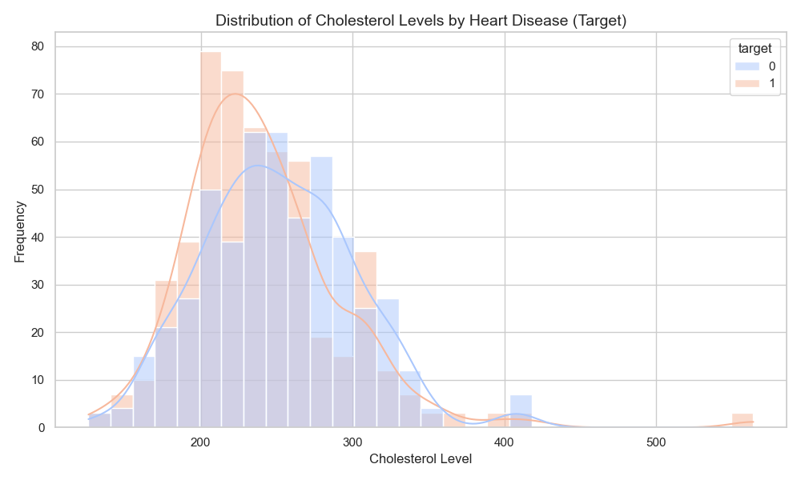
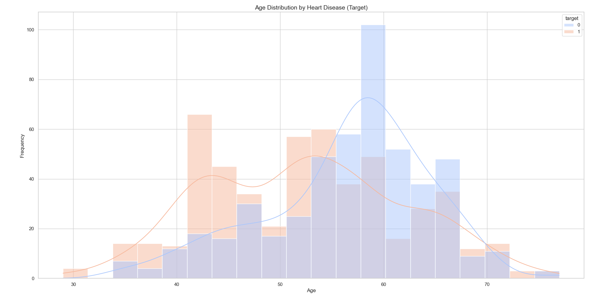
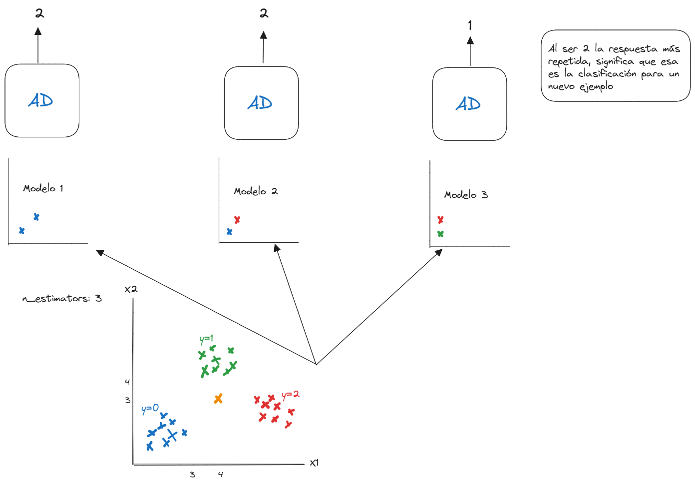
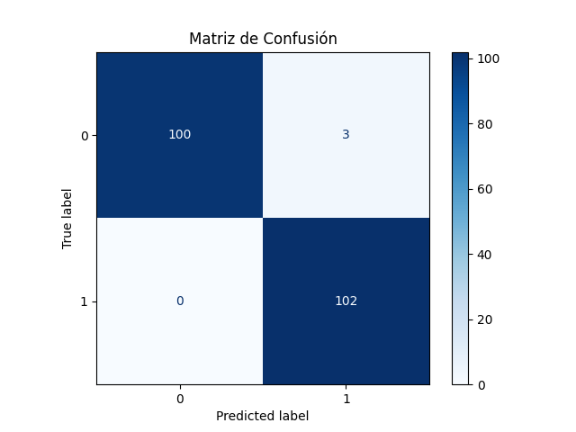

# Introducción
En este proyecto quisé poner en práctica los conocimientos que he adquirido sobre el algoritmo de Random Forest para tareas de clasificación, y realizar un análisis más profundo del conjunto de datos.

- **Link del dataset**: [Dataset de Kaggle](https://www.kaggle.com/datasets/johnsmith88/heart-disease-dataset)

# Tech Stack
- **Python**
- **Scikit-learn**
- **Pandas**
- **Numpy**
- **Matplotlib**
- **Seaborn**

# Explicación
Lo primero que hice fue realizar un análisis exploratorio de los datos, y durante este proceso descubrí un par de insights que me sorprendieron bastante. En primer lugar, pude observar que los niveles de colesterol altos no necesariamente contribuyen a padecer enfermedades cardiovasculares. Más bien, analicé que existe un intervalo entre 200 y 230 de niveles de colesterol donde la cantidad de personas con problemas cardíacos es elevada, alcanzando entre 60 y 70 personas. Sin embargo, entre los rangos de 230 a 300 de niveles de colesterol, se observa una mayor concentración de personas sin enfermedades cardiovasculares.

Es importante mencionar que este es un análisis prematuro y que no considera factores adicionales que podrían influir en las conclusiones, como el tipo de colesterol (HDL, LDL, triglicéridos), la edad, el género y otros indicadores del dataset. A pesar de ello, quise destacar este dato porque me llamó mucho la atención durante la exploración inicial.

- **0**: Sin enfermedad cardiovascular.
- **1**: Con enfermedad cardiovascular.



Otro insight interesante que se puede observar es que las personas con enfermedades cardiovasculares se encuentran con mayor frecuencia entre los 42 y 52 años. Por otro lado, el grupo de personas sin signos de enfermedades cardiovasculares tiende a concentrarse entre los 55 y 60 años. Este análisis es preliminar y podrían influir otros factores, como la distribución de edades en la muestra o variables relacionadas con el estilo de vida, genética y condiciones médicas.



El algoritmo de Random Forest permite entrenar "n" árboles de decisión de manera independiente, utilizando diferentes subconjuntos de datos y características. Para problemas de clasificación, el resultado final se selecciona mediante votación por mayoría, considerando la clase que más veces predicen los árboles.



# Pasos para Inicializar el Proyecto

1. **Instalar los paquetes:**
    ```sh
    pip install
    `

2. **Ubicarse en la carpeta src:**
    ```sh
    cd src
    ```

3. **Ejecutar el archivo para probar el modelo:**
    ```sh
    python .\model.py
    ```

# Resultados
Los resultados del modelo reflejan un buen desempeño en la clasificación:

Model Score: 0.9854
- **Accuracy**: 98.5% (indica que el modelo predice correctamente la mayoría de las instancias)
- **Precision**: 100.0% (el modelo no generó falsos positivos, mostrando una alta precisión en las predicciones positivas)
- **Recall**: 97.1% (el modelo identificó correctamente el 97.1% de los casos positivos reales)
- **F1 Score**: 98.5% (el balance entre precision y recall es óptimo, lo que resalta su fiabilidad)


